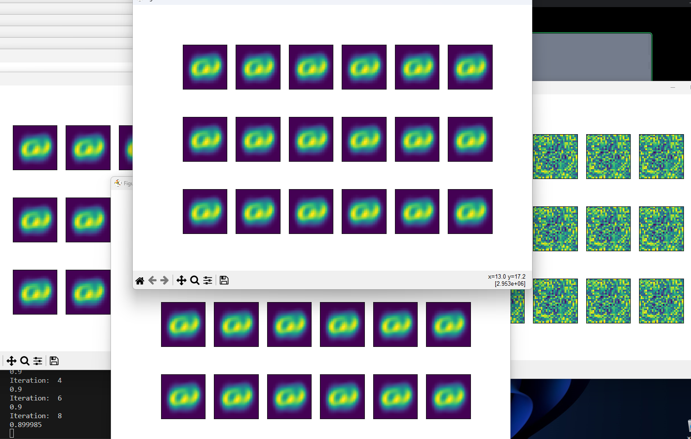

Digit-recogniser 
model of neural network, which computes the pixel's dependances
and pass through 60.000 images 'i' times

it is not executable, so it has no interface or release such that 
it can be used as an app.

Only functional proggraming and project to somehow explore ML,
I appreciate anyone participating it.

"""

all issues and problems are noted in code, they are primary 
to fix/explain/remake.

PLEASE___
Add as much information as possible about your contribution
so that contributor can read and understand it.

"""

dataset availiable here -> 
https://disk.yandex.ru/d/0umrnwI6PEHzLg

all the math formulas and ideas I borrowed from following kaggle notebook -> 
https://www.kaggle.com/code/wwsalmon/simple-mnist-nn-from-scratch-numpy-no-tf-keras/notebook

in this notebook accuracy is 85%, while our model
gets 85 as it starts (which quite strange and incomprehensible) and reach 0.9 as maximum

LOGIC 
{
zero_layer {
    # input layer

    A0 := matrix(60.000x784) 
    (columns=vector_image(each element is i-th pixel), rows=images)
    }
first_layer {
    # hidden layer

    w1 := matrix(784x10) of coeficients multiplying each connection between two nodes  
    b1 := matrix(10x1) bias of each node (constant adding to i-th node result)
    Z1 := matrix(10x1) result vector of scalar multiplication of w1 * A0 + b1
    A1 := matrix(10x1) ReLU(Z1) (ReLU() function defined and explained in code)
    }
second_layer {
    # output layer

    w2 := matrix(10x10) (exactly the same to first one but different connections)
    b2 := matrix(10x1) bias of each node 
    Z2 := matrix(10x1) result vector of scalar multiplication of w2 * A1 + b2
    A2 := matrix(10x1) (softmax(Z2) function defined and explained in code)
    }
}

which is also confusing, is that weights of first hidden layer images 
looks strange as pixels (they're not looks familiar with the exact numbers AT ALL)

____________
0.9
Iteration:  6
0.9                       ???
Iteration:  8
0.899985
____________

all another issues you'll find in the code :/

!!!Images from the following forms

1x1 1x2 ... 1x28
2x1 2x2 ... 2x28
...         ...
28x1 ...... 28x28

In table "table_name.csv" it should be as:
label,pixel1,pixel2,pixel3,...,pixel783,pixel784
7,0,0,0,...,0,0
.....
